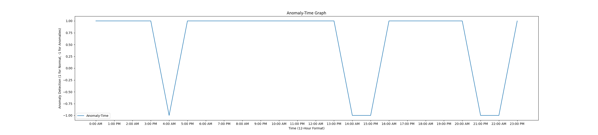

# Anomaly Detection in Time-Value Graph

This Python script generates a time-value graph with anomalies, detects the anomalies, and corrects them. The graph uses a 12-hour format with AM/PM indicators while representing time values from 00 to 23.

## Overview

The script performs the following tasks:

1. Generates a time-value graph with a daily pattern.
2. Introduces anomalies at specific hours.
3. Uses Isolation Forest for anomaly detection.
4. Corrects detected anomalies based on previous values.
5. Plots three graphs for visualization:
   - Value-Time Graph (with Anomalies)
   - Anomaly-Time Graph
   - Corrected Value-Time Graph (with Anomalies)

## Dependencies

Make sure you have the following Python libraries installed:

- numpy
- matplotlib
- scikit-learn (for Isolation Forest)

Install them using pip:

```bash
pip install numpy matplotlib scikit-learn
```
## Usage
1. Clone this repository to your local machine:
   ```bash
   git clone https://github.com/yourusername/your-repo.git
   ```
2. Navigate to the project directory:
    ```bash
   cd repo_name
   ```
3. Run the Python script:
   ```bash
   python anomaly_detection.py
   ```

## View the generated graphs

#### Initial Dataset (with Anomalies) and Anomalies (Anomaly Detection)
 


#### Corrected Value (with Anomalies)


## Parameters

You can adjust the following parameters in the script:
* `timestamps`: The timestamp values (in a 12-hour format with AM/PM indicators).
* `normal_data`: The normal data with a daily pattern.
* `anomaly_indices`: Indices of the hours where anomalies are introduced.
* `ampm`: AM/PM indicators for the timestamp labels.
* `contamination`: Contamination parameter for Isolation Forest (adjust for anomaly detection sensitivity).

## Credits

This project was created by [Sreshta](mailto:sreshtapothula2@gmail.com). If you have any questions or suggestions, feel free to reach out.

Happy coding! 🚀
